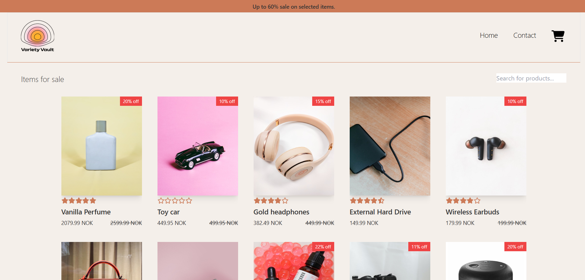

# Variety Vault (JavaScript Frameworks CA)



## Project Overview

This project is an e-commerce store developed as part of my university studies. It uses React along with Vite as the build tool, and Tailwind CSS for styling. The project aims to provide a seamless shopping experience with a modern design.

---

## Website Link

Visit the live site: [VarietyVault](https://varietyvault.netlify.app/)

[](https://app.netlify.com/sites/varietyvault/deploys)

---

## Table of Contents

- [Project Overview](#project-overview)
- [Features](#features)
- [Tech Stack](#tech-stack)
- [Getting Started](#getting-started)
  - [Prerequisites](#prerequisites)
  - [Installation](#installation)
- [Running the Project](#running-the-project)
- [Acknowledgments](#acknowledgments)
- [Contact](#contact)

---

## Features

- **Product Browsing**
- **Cart functionality**
- **Search capability with auto-complete**
- **Responsive layout for various devices**

---

## Tech Stack

<span>
  
  
</span>

- **Vite** - Fast and modern front-end build tool
- **React** - JavaScript library for building user interfaces
- **Javascript** - Superset of JavaScript for static type-checking
- **Tailwind CSS** - Utility-first CSS framework for styling
- **Netlify** - Hosting and continuous deployment
- **API** - Provided by the university, handling backend functionalities

---

## Getting Started

To get a local copy up and running, follow these steps.

### Prerequisites

- **Node.js** and **npm** - Make sure Node.js and npm are installed on your system.

### Installation

1. **Clone the repository:**

   ```bash
   git clone https://github.com/oddvarzk/frameWorksCA.git
   ```

2. **Navigate to the project directory:**

   ```bash
   cd frameWorksCA
   ```

3. **Install dependencies:**

   ```bash
   npm install
   ```

## Running the Project

To start the development server, run:

```bash
npm run dev
```

This will start the app on [http://localhost:3000](http://localhost:3000) or the next available port.

To build the project for production, run:

```bash
npm run build
```

To preview the production build locally, run:

```bash
npm run preview
```

---

## Acknowledgments

- **Noroff School of Technology and Digital Media**
- **Vite**
- **React**
- **Tailwind CSS**
- **Netlify**

---

## Contact

For any inquiries or feedback, please contact:

- **Name:** Oddvar Zakarias Kristiansen
- **Email:** [oddvarzk@gmail.com](mailto:oddvarzk@gmail.com)
- **GitHub:** [oddvarzk](https://github.com/oddvarzk)
- **LinkedIn:** [Oddvar Zakarias Kristiansen](https://www.linkedin.com/in/oddvar-zakarias-kristiansen-22b583262/)

---
